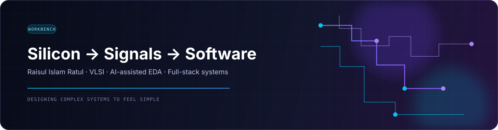

  

  

  
  &nbsp;&nbsp;
  
  &nbsp;&nbsp;
  
  &nbsp;&nbsp;
  
  &nbsp;&nbsp;
  

 

# Raisul Islam Ratul

### I design the systems between silicon and software.

Electrical and Electronic Communication Engineering graduate from **MIST**, IEEE-published researcher, and builder working across **VLSI, AI-assisted EDA, FPGA systems, signal processing, and full-stack products**.

> From transistor-level circuits to interfaces people can use, I like turning difficult systems into clear, working experiences.

## The short version

| Research | Build | Explore |
|:---|:---|:---|
| Deep-learning-based circuit analysis and 90 nm CMOS design | RTL, FPGA, DSP pipelines, and full-stack applications | AI hardware acceleration, automated EDA, and neuromorphic computing |

## What I work on

<table>
<tr>
<td width="33%" valign="top">

### Silicon & VLSI

I design and analyze digital and analog systems across RTL, CMOS, simulation, layout, physical verification, and timing-oriented workflows.

`Verilog` `VHDL` `Cadence` `SPICE` `FPGA`

</td>
<td width="33%" valign="top">

### Signals & intelligent systems

I build systems that extract structure from signals and schematics, combining DSP, computer vision, deep learning, OCR, and engineering domain knowledge.

`Python` `PyTorch` `MATLAB` `OpenCV`

</td>
<td width="33%" valign="top">

### Products & interfaces

I turn technical ideas into usable software through responsive interfaces, APIs, data flows, and deployment-ready web applications.

`TypeScript` `React` `Node.js` `Vercel`

</td>
</tr>
</table>

  <strong>STACK SIGNALS</strong>
    
  &nbsp;&nbsp;
  &nbsp;&nbsp;
  &nbsp;&nbsp;
  &nbsp;&nbsp;
  &nbsp;&nbsp;
  &nbsp;&nbsp;
  &nbsp;&nbsp;
  

## Selected work

<table>
<tr>
<td width="50%" valign="top">

### [Schematics → Netlists](https://github.com/IzayaRais/Schematics-to-Netlists-Deep-Learning-Based-Electrical-Circuit-Analysis)

An AI-assisted workflow for detecting electrical components in schematics and generating SPICE-ready netlists using object detection and OCR-based text fusion.

**Research:** [IEEE QPAIN 2026](https://doi.org/10.1109/QPAIN69676.2026.11545525)

</td>
<td width="50%" valign="top">

### [DESCO Smart Meter Monitor](https://github.com/IzayaRais/desco-smart-meter-monitor)

A privacy-focused, zero-database dashboard that connects to the official DESCO customer portal and turns meter data into balances, usage trends, recharge insights, anomalies, and projections.

**Focus:** TypeScript · data visualization · product UX

</td>
</tr>
<tr>
<td width="50%" valign="top">

### [LECTOR-Based CS-VCO](https://github.com/IzayaRais/LECTOR-Based-CS-VCO-90nm-CMOS)

Low-power current-starved VCO design in 90 nm CMOS for wireless IoT networks, reaching 95.472 µW power and 3.873–5.526 GHz tuning range.

**Research:** [IEEE ICCIT 2025](https://doi.org/10.1109/ICCIT68739.2025.11552593)

</td>
<td width="50%" valign="top">

### [Portfolio](https://raisul-ratul-portfolio.vercel.app/)

A focused home for my VLSI research, FPGA work, signal-processing experiments, and software projects—built to make technical work easier to understand.

**Focus:** JavaScript · responsive UI · deployment

</td>
</tr>
</table>

## Research notes

| Publication | What it explores |
|:---|:---|
| [From Schematics to Netlists: Deep Learning Based Electrical Circuit Analysis](https://doi.org/10.1109/QPAIN69676.2026.11545525) | Computer vision, OCR, deep learning, and EDA automation |
| [Low-Power LECTOR-Based Current-Starved VCO in 90 nm CMOS for Wireless IoT Networks](https://doi.org/10.1109/ICCIT68739.2025.11552593) | Low-power CMOS design, VLSI, oscillators, and wireless IoT |

## GitHub telemetry

  

  
  

  

  

<strong>What these numbers mean</strong>

These visuals are a live view of public GitHub activity: repositories, language mix, commit history, contribution streaks, and the rhythm of recent work. They complement the curated project stories above rather than replacing them.

## Pinned workbench

<table>
<tr>
<td width="50%" valign="top">

### [Pulse-Code-Modulation PCM](https://github.com/IzayaRais/Pulse-Code-Modulation-PCM-Decoding-System)

Hardware-oriented PCM encoder and decoder system with PCB design and MATLAB/Simulink exploration.

</td>
<td width="50%" valign="top">

### [Ticketing App](https://github.com/IzayaRais/ticketing-app)

A pinned TypeScript application repository focused on building a practical product workflow.

</td>
</tr>
<tr>
<td width="50%" valign="top">

### [LECTOR-Based CS-VCO](https://github.com/IzayaRais/LECTOR-Based-CS-VCO-90nm-CMOS)

Low-power 90 nm CMOS VCO design for wireless IoT networks, published in IEEE ICCIT 2025.

</td>
<td width="50%" valign="top">

### [CLB VLSI Design](https://github.com/IzayaRais/CLB-VLSI-Design)

Complete CMOS-level design, layout, DRC/LVS verification, and characterization of a configurable logic block.

</td>
</tr>
</table>

Repository names are curated from your GitHub pinned list; the badges update live from GitHub repository metadata.

## Live workbench

The repository list below is refreshed automatically, so this section reflects the projects I am actively touching rather than only the projects I have already finished.

<!-- START_RECENT_REPOS -->
| Recently updated | Description | Last pushed |
|:---|:---|:---|
| [desco-smart-meter-monitor](https://github.com/IzayaRais/desco-smart-meter-monitor) | A privacy-focused, zero-database real-time analytics dashboard for DESCO prepaid electricity meter customers in Bangl… | 2026-08-13 |
| [FMHY](https://github.com/IzayaRais/FMHY) | Make changes to FMHY | 2026-08-08 |
| [opendataloader-pdf](https://github.com/IzayaRais/opendataloader-pdf) | PDF Parser for AI-ready data. Automate PDF accessibility. Open-source. | 2026-08-07 |
<!-- END_RECENT_REPOS -->

## Current direction

I am especially interested in work where **hardware knowledge becomes leverage for better software**: intelligent EDA tools, hardware-aware machine learning, efficient computing, and engineering interfaces that make complex systems legible.

If you are working on semiconductor design, applied AI, embedded systems, signal processing, or a product that needs both technical depth and a clear user experience, I would be glad to connect.

**[Explore the repositories](https://github.com/IzayaRais?tab=repositories)** &nbsp;·&nbsp; **[Read the portfolio](https://raisul-ratul-portfolio.vercel.app/)** &nbsp;·&nbsp; **[Start a conversation](mailto:raisultensors@gmail.com)**

 

Bridging silicon, signals, and software.

 

